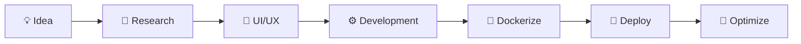

<div align="center">


<br/>


</div>

---

# 🌸 About Me


```yaml
name: Shahriyar Sojib Hasan
birthday: 29 May
role: Full-Stack Developer
location: Bangladesh
focus:
  - Modern Web Applications
  - Backend Architecture
  - Open Source
  - Futuristic UI/UX
  - DevOps & Automation

loves:
  - Linux
  - Terminal customization
  - Music
  - Coffee
  - Travel
  - Cyberpunk aesthetics

dream:
  Travel the world while coding 🌍
```

<br clear="right"/>

---

# 🧬 Developer Profile

<div align="center">

<table>
<tr>
<td width="50%">

### 👨‍💻 Identity

- 🧠 Hacker mindset
- ⚡ Clean code enthusiast
- 🌸 Cyberpunk aesthetic lover
- 🚀 Constant learner
- 🔥 Open-source contributor
- 🐧 Linux daily driver

</td>

<td width="50%">

### 🎯 Current Goals

- Building scalable products
- Mastering cloud-native systems
- Contributing to OSS
- Designing futuristic interfaces
- Exploring Rust ecosystem
- Automating everything possible

</td>
</tr>
</table>

</div>

---

# ⚒️ Tech Arsenal

<div align="center">


</div>

---

# 📊 GitHub Analytics

<div align="center">


<br/>


</div>

---

# 🐍 Contribution Snake

<div align="center">


</div>

---

# 🖥️ Digital Workspace

<div align="center">

<table>
<tr>
<td align="center" width="33%">

### 💻 OS

```bash
Arch Linux
Windows 11
WSL2
```

</td>

<td align="center" width="33%">

### 🧠 Editor

```bash
VS Code
Neovim
JetBrains
```

</td>

<td align="center" width="33%">

### ☕ Fuel

```bash
Coffee
Music
Late-night coding
```

</td>
</tr>
</table>

</div>

---

# ⚡ Workflow

<div align="center">



</div>

---

# 🖤 Terminal.log

```bash
┌──(shahriyar㉿github)-[~/workspace]
└─$ whoami

> Full-Stack Developer
> Open Source Enthusiast
> Linux Power User
> Cyberpunk Interface Designer

┌──(shahriyar㉿github)-[~/workspace]
└─$ sudo apt install future

[sudo] password for shahriyar:

Installing...
██████████████████████████ 100%

Future successfully installed 🚀
```

---

# 🌌 Philosophy

<div align="center">

> Code is not just logic.  
> It is design, emotion, architecture, and vision combined into one digital experience.

<br/>

> Build systems that feel alive.

</div>

---

# 🌐 Connect With Me

<div align="center">

<a href="https://github.com/shahriyarsojib">

</a>

<a href="https://x.com/shahriyarsojib_">

</a>

<a href="mailto:shahriyar@example.com">

</a>

<a href="https://discord.com">

</a>

</div>

---

# 🌸 Current Vibes

<div align="center">


</div>

---

<div align="center">


### ⚡ Shahriyar Sojib Hasan ⚡

Cyberpunk soul • Open source mind • Infinite curiosity

</div>
